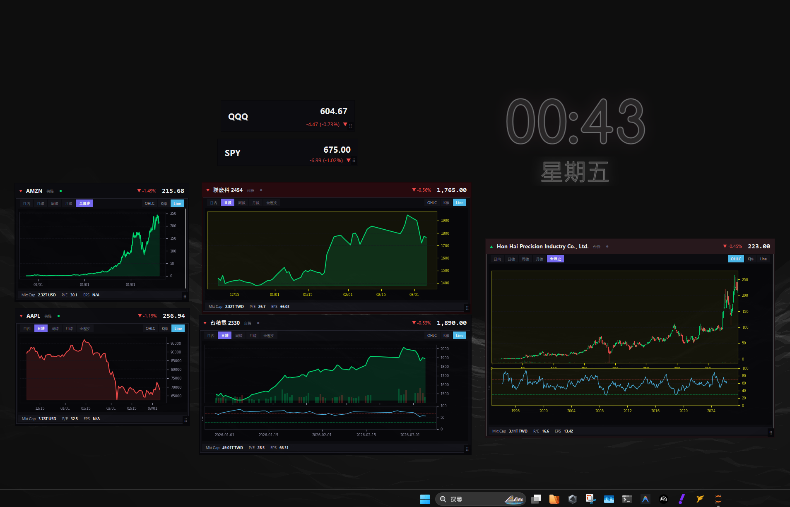

<div align="center">


# Vestra — Stock Desktop Widget

**A sleek, always-on-top desktop stock widget for power investors**  
**優雅的桌面股票看板，專為重度投資者打造**

[](https://www.python.org/)
[](LICENSE)
[](https://www.microsoft.com/windows)

</div>

---

## 🇺🇸 English | [🇹🇼 中文](#-中文說明)

### ✨ Features

- 📈 **Live price feed** — Taiwan stocks (Fugle API), US stocks & ETFs, Crypto (yfinance)
- 🕯 **Interactive chart** — Line, K-bar, and OHLC chart modes with crosshair hover tooltip
- 🗂 **Multi-asset watchlist** — Monitor TW stocks, US stocks, ETFs, and Crypto simultaneously
- 🎨 **Full color customization** — Independently customize background tint and chart accent colors per card
- 📊 **Fundamental data** — Inline Market Cap, P/E, and EPS below the chart
- 📉 **RSI & Volume overlay** — Optional RSI indicator and volume bar overlay
- 💼 **P&L simulation** — Enter your average cost and quantity to track unrealized P&L in real time
- 🔔 **Price alerts** — Set above/below threshold alerts with desktop notifications
- 🔒 **Lock & drag** — Drag cards freely or lock them in place on your desktop
- 🚀 **Auto-start on boot** — Included `.vbs` launcher for silent Windows startup

---

### 🖥 Demo



---

### 🚀 Quick Start

#### 1. Clone the repo
```bash
git clone https://github.com/YOUR_USERNAME/Vestra.git
cd Vestra
```

#### 2. Install dependencies
```bash
pip install -r requirements.txt
```

#### 3. (Optional) Set up API keys
Create a `.env` file in the root directory:
```ini
FUGLE_API_KEY=your_fugle_key_here        # Taiwan real-time data
FINMIND_TOKEN=your_finmind_token_here    # Taiwan historical data (optional)
```
> Without API keys, the widget falls back to **yfinance** for all data.

#### 4. Run the widget
```bash
python -m widget.main
```

---

### ⚙️ Auto-start on Windows Boot

Double-click `widget/launch_widget.vbs` to test, then copy **a shortcut** of it to:
```
%APPDATA%\Microsoft\Windows\Start Menu\Programs\Startup\
```
The widget will launch silently (no terminal window) every time you log in.

---

### 📁 Project Structure

```
Vestra/
├── widget/
│   ├── main.py               # Entry point
│   ├── widget_manager.py     # Manages all CardWindows
│   ├── manager_panel.py      # Settings / watchlist management UI
│   ├── card_window.py        # Individual floating card window
│   ├── tray_icon.py          # System tray icon
│   ├── widget_config.json    # Watchlist & settings (auto-saved)
│   ├── launch_widget.vbs     # Silent Windows startup launcher
│   ├── components/
│   │   ├── chart_card.py     # Interactive chart with crosshair
│   │   └── ticker_row.py     # Compact ticker display
│   ├── data/
│   │   ├── tw_stock_feed.py  # Taiwan stock real-time feed
│   │   ├── us_stock_feed.py  # US stock / ETF real-time feed
│   │   ├── crypto_feed.py    # Cryptocurrency real-time feed
│   │   ├── history_loader.py # OHLCV history loading
│   │   ├── indicator_feed.py # RSI & technical indicators
│   │   ├── alert_manager.py  # Price alert engine
│   │   └── symbol_lookup.py  # Symbol name resolver
│   └── style/
│       └── theme.py          # Centralized dark-mode color tokens
├── requirements.txt
└── README.md
```

---

### 🗂 Watchlist Config (`widget_config.json`)

The watchlist is stored in `widget/widget_config.json`.  
A sample configuration covering TW stocks, ETFs, US stocks, and crypto is included.

Key fields per card:
| Field | Description |
|-------|-------------|
| `symbol` | Ticker (e.g. `2330`, `SPY`, `BTCUSDT`) |
| `category` | `台股`, `ETF`, `美股`, `Crypto` |
| `display` | `chart` or `ticker` |
| `timeframe` | `日內`, `日線`, `周線`, `月線`, `全歷史` |
| `bg_tint` | Custom background color (hex) |
| `chart_accent` | Custom axis & label color (hex) |
| `qty` / `cost` | Holdings for P&L simulation |

---

### 🛠 Tech Stack

| Layer | Technology |
|-------|------------|
| UI Framework | Python `tkinter` / `ttk` |
| Charts | `matplotlib` (TkAgg backend) |
| Data — TW Real-time | Fugle MarketData API |
| Data — US/Crypto | `yfinance` |
| Data — TW History | FinMind / yfinance fallback |
| Fundamentals | `yfinance` |

---

### 📄 License

MIT License — free to use, modify, and distribute.

---

---

## 🇹🇼 中文說明

### ✨ 功能特色

- 📈 **即時報價** — 台股（Fugle API）、美股 / ETF、加密貨幣（yfinance）
- 🕯 **互動式圖表** — 折線、K棒、OHLC 三種圖表模式，支援滑鼠十字游標與價格氣泡
- 🗂 **多資產看板** — 同時監控台股、美股、ETF、加密貨幣
- 🎨 **完整顏色自訂** — 每張卡片可獨立調整背景色調與圖表文字色
- 📊 **基本面資料** — 圖表下方即時顯示市值、本益比、EPS
- 📉 **RSI 與成交量** — 可開啟 RSI 指標與成交量疊加圖
- 💼 **損益模擬** — 輸入持倉成本與股數，即時追蹤未實現損益
- 🔔 **價格警報** — 設定上下限觸發桌面通知
- 🔒 **鎖定與拖曳** — 自由拖曳或鎖定卡片位置
- 🚀 **開機自動啟動** — 附帶 `.vbs` 靜默啟動器，登入後自動開啟，無終端機視窗

---

### 🚀 快速開始

#### 1. 下載專案
```bash
git clone https://github.com/poh429/Vestra.git
cd Vestra
```

#### 2. 安裝依賴套件
```bash
pip install -r requirements.txt
```

#### 3. （選用）設定 API 金鑰
在根目錄建立 `.env` 檔案：
```ini
FUGLE_API_KEY=你的_fugle_key     # 台股即時資料
FINMIND_TOKEN=你的_finmind_token  # 台股歷史資料（選用）
```
> 不設定也沒關係，程式會自動改用 **yfinance** 抓取所有資料。

#### 4. 啟動 Widget
```bash
python -m widget.main
```

---

### ⚙️ 開機自動啟動

測試用：雙擊 `widget/launch_widget.vbs`  
設定開機啟動：將 `launch_widget.vbs` 的**捷徑**複製到：
```
%APPDATA%\Microsoft\Windows\Start Menu\Programs\Startup\
```
之後每次登入 Windows 都會自動靜默啟動，不會彈出終端機視窗。

---

### 🗂 看板設定（`widget/widget_config.json`）

看板中已包含台股、美股、ETF、加密貨幣的範例設定。  
每張卡片的主要設定欄位：

| 欄位 | 說明 |
|------|------|
| `symbol` | 股票代號（如 `2330`、`SPY`、`BTCUSDT`）|
| `category` | `台股`、`ETF`、`美股`、`Crypto` |
| `display` | `chart`（圖表）或 `ticker`（精簡數字）|
| `timeframe` | `日內`、`日線`、`周線`、`月線`、`全歷史` |
| `bg_tint` | 自訂背景色（hex 顏色碼）|
| `chart_accent` | 自訂座標軸與文字色（hex 顏色碼）|
| `qty` / `cost` | 持倉數量與成本（損益模擬）|

---

*Made with ❤️ in Python · 用 Python 打造*
